# Checkpoint 02 — APIs, energias renováveis e aprendizado de máquina

**FIAP · Ciência da Computação · 2º semestre · Soluções em Energias Renováveis e Sustentáveis (SERS)**

| Integrante | RM |
|---|---|
| Tiago MUhlmann | RM569569 |
| Wesley Marques | RM573915 |
| Marcos Sampaio | RM753987 |
| Otavio Mancilia | RM570225 |
| Gabriela Angel | RM570808 |
| Izabelly Menezes | RM570673 |

## Objetivo

Consultar duas APIs públicas de dados de energia e clima, preparar os dados e resolver duas tarefas de aprendizado de máquina, **comparando três algoritmos em cada uma**:

1. **Classificação:** prever a fonte de um empreendimento de geração (Solar, Eólica ou Hidráulica) a partir da potência outorgada e da localização (ANEEL/SIGA).
2. **Regressão:** estimar a radiação solar horária em Petrolina (PE) a partir de temperatura, umidade, nuvens, vento e hora do dia (Open-Meteo).

As duas tarefas foram feitas em **Python** (notebook) e repetidas no **Orange Data Mining** (atividade complementar), com os mesmos algoritmos e a mesma divisão de dados.

## Estrutura do repositório

```
├── Checkpoint02_APIs_Energia_Renovavel_ML.ipynb   # notebook completo: APIs, análise, 6 modelos, gráficos e conclusões
├── aneel_classificacao_orange.csv                 # dados da Tarefa 1 (gerados a partir da API da ANEEL)
├── meteo_regressao_orange.csv                     # dados da Tarefa 2 (gerados a partir da API Open-Meteo)
├── requirements.txt
├── figuras/                                       # gráficos gerados pelo notebook
├── resultados/                                    # tabelas de métricas geradas pelo notebook
└── orange/
    ├── fluxo_classificacao.ows                    # fluxo do Orange — classificação
    ├── fluxo_regressao.ows                        # fluxo do Orange — regressão
    ├── aneel_treino_80.csv / aneel_teste_20.csv   # mesma divisão estratificada usada no Python
    ├── meteo_treino_80.csv / meteo_teste_20.csv   # mesma divisão temporal usada no Python
    └── capturas/                                  # capturas de tela dos fluxos e resultados
```

## Dados

| | Tarefa 1 — ANEEL | Tarefa 2 — Open-Meteo |
|---|---|---|
| Fonte | [SIGA — ANEEL](https://dadosabertos.aneel.gov.br/dataset/siga-sistema-de-informacoes-de-geracao-da-aneel), API CKAN `datastore_search`, recurso `11ec447d-698d-4ab8-977f-b424d5deee6a` | [API histórica Open-Meteo](https://open-meteo.com/en/docs/historical-weather-api) (`archive-api.open-meteo.com/v1/archive`) |
| Recorte | Até 1.200 registros por sigla: `UFV` (Solar), `EOL` (Eólica), `UHE`+`PCH`+`CGH` (Hidráulica) | Petrolina (PE), lat −9,39, long −40,50, **01/04/2025 a 30/06/2025**, fuso `America/Recife`, horas das 7h às 17h |
| Linhas | 3.876 empreendimentos (Solar 1.200, Eólica 1.200, Hidráulica 1.476), sem valores ausentes | 1.001 horas (91 dias × 11 horas), sem valores ausentes |
| Entradas (X) | `potencia_kw` (potência outorgada, kW), `latitude`, `longitude` (graus decimais) | `temperatura_c` (°C), `umidade_pct` (%), `nuvens_pct` (%), `vento_kmh` (km/h), `hora` (hora local) |
| Alvo (y) | `fonte` (Solar, Eólica, Hidráulica) | `radiacao_w_m2` — radiação global horizontal média da hora anterior (W/m²) |
| Observação | Cadastro de empreendimentos em várias fases; **não mede energia gerada** e a contagem por classe **não** representa a matriz energética | Dados estimados por modelo/reanálise, não medidos em um painel; `data_hora` só ordena e separa os dados |

Nenhuma das APIs exige token. Nada de senha ou chave foi publicado.

## Como executar

**Notebook (Python)**

1. Abra `Checkpoint02_APIs_Energia_Renovavel_ML.ipynb` no Google Colab (*Arquivo → Abrir notebook → GitHub*, cole o link deste repositório) ou localmente com Jupyter.
2. Localmente, instale as dependências: `pip install -r requirements.txt`.
3. Execute **todas as células em ordem** (*Ambiente de execução → Executar tudo*).

O notebook consulta as duas APIs e gera os CSVs. Se a rede bloquear a consulta, ele usa os CSVs deste repositório (os mesmos gerados pelo notebook de apoio do professor) e segue normalmente. Ele também grava os gráficos em `figuras/`, as métricas em `resultados/` e as divisões de treino/teste em `orange/`.

**Orange Data Mining**

1. Instale o [Orange](https://orangedatamining.com/download/) (testado na versão 3.40).
2. Abra `orange/fluxo_classificacao.ows` ou `orange/fluxo_regressao.ows` (*File → Open*). Os widgets *File* apontam para os CSVs da própria pasta `orange/`, por caminho relativo.
3. Clique duas vezes em **Test and Score** para ver as métricas, e em **Confusion Matrix** / **Predictions** para ver os erros.

---

## Tarefa 1 — Classificação da fonte (Python)

**Procedimento:** `train_test_split` **estratificado**, 80% treino (3.100) / 20% teste (776), `random_state=42`. Padronização (`StandardScaler`) dentro de um `Pipeline` para Regressão Logística e kNN, ajustada só no treino. Métricas multiclasse com **média macro**.

| Modelo | Configuração | Accuracy | Precision (macro) | Recall (macro) | F1 (macro) |
|---|---|---:|---:|---:|---:|
| Regressão Logística | StandardScaler + `LogisticRegression(C=1)` | 0,825 | 0,828 | 0,821 | 0,820 |
| kNN | StandardScaler + `KNeighborsClassifier(n_neighbors=5)` | 0,965 | 0,966 | 0,964 | 0,965 |
| **Random Forest** | `RandomForestClassifier(n_estimators=100, min_samples_split=5)` | **0,970** | **0,972** | **0,968** | **0,970** |

Validação cruzada estratificada (5 partes) confirma a ordem: Random Forest 0,973 · kNN 0,961 · Regressão Logística 0,808.

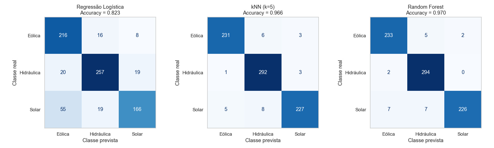

**Conclusões:**

- **Melhor modelo: Random Forest**, com os melhores valores nas quatro métricas. O kNN fica próximo, o que mostra que a localização carrega muita informação (vizinhos tendem a ter a mesma fonte).
- **Classes mais confundidas:** na Regressão Logística, **Solar prevista como Eólica** (51 casos), porque uma fronteira linear não separa "ilhas" geográficas. Na Random Forest, os poucos erros (23 de 776) são solares fora do agrupamento principal, previstas como Eólica (8) ou Hidráulica (7) — usinas solares de dezenas de MW no Nordeste se parecem com parques eólicos em potência e posição.
- **Limitações:** a acurácia alta reflete a **amostra** e não uma regra física. A consulta traz as primeiras 1.200 linhas de cada sigla: 732 das solares estão quase no mesmo ponto do oeste do Pará e quase todas têm exatamente 1 kW. Faltam variáveis físicas (recurso solar, vento, rios, relevo), há sobreposição real entre solar e eólica no semiárido, e 47 empreendimentos têm coordenada (0, 0), que é dado ausente. Potência outorgada também não é energia gerada.

## Tarefa 2 — Regressão da radiação solar (Python)

**Procedimento:** divisão **temporal**, sem embaralhar: primeiras 80% das horas para treino (800 horas, 01/04 a 12/06/2025 14h) e últimas 20% para teste (201 horas, 12/06/2025 15h a 30/06/2025 17h).

| Modelo | Configuração | MAE (W/m²) | MSE ((W/m²)²) | RMSE (W/m²) | R² |
|---|---|---:|---:|---:|---:|
| Regressão Linear | `LinearRegression()` | 145,2 | 30.034 | 173,3 | 0,360 |
| Árvore de Decisão | `DecisionTreeRegressor(min_samples_leaf=2, min_samples_split=5)` | 86,7 | 14.359 | 119,8 | 0,694 |
| **Random Forest** | `RandomForestRegressor(n_estimators=100, min_samples_split=5)` | **67,9** | **7.457** | **86,4** | **0,841** |

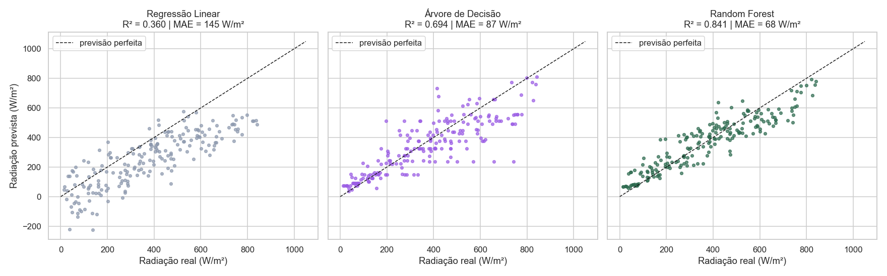

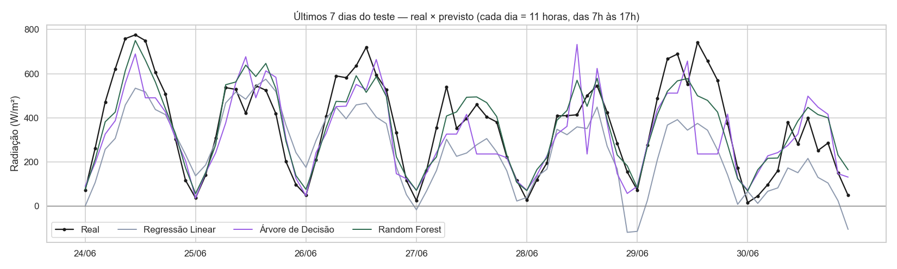

**Conclusões:**

- **Melhor modelo: Random Forest** nas três métricas — erro médio de ~68 W/m² e R² de 0,84.
- **Papel da hora:** a hora define a posição do Sol e, portanto, a radiação máxima possível. A relação tem forma de sino (mediana de 84 W/m² às 7h, 799 W/m² às 12h). Por isso a correlação linear da hora é quase nula (0,12) e a **Regressão Linear** não consegue usá-la — chega a prever radiação negativa. Os modelos de árvore dividem o dia em faixas; na Random Forest, a hora é a variável mais importante (0,49).
- **Erros:** os maiores ficam entre 10h e 15h em dias com nebulosidade, porque a cobertura de nuvens em % não informa a espessura da nuvem. O teste (fim de junho, perto do solstício de inverno) tem radiação média menor que o treino (373 contra 498 W/m²), e nenhuma entrada representa a época do ano.
- **Radiação não é geração elétrica:** W/m² é potência por área que chega ao solo horizontal. Para estimar a energia (kWh) de um sistema fotovoltaico é preciso considerar área e eficiência dos módulos, temperatura das células, inclinação e orientação do painel, perdas no inversor, cabos, sujeira e sombreamento, e integrar no tempo. Além disso, os valores do Open-Meteo são estimados por modelo, não medidos numa usina.

---

## Atividade complementar — Orange Data Mining

Os dois fluxos usam os **mesmos três algoritmos** de cada tarefa do Python e a **mesma divisão** de dados: o notebook exporta os conjuntos de treino e teste para `orange/`, e o **Test and Score** usa a opção **Test on test data** (conjunto de teste separado). Por isso a comparação com o notebook é direta.

### Fluxo 1 — Classificação (ANEEL)

`File (treino 80%) → Select Columns → Test and Score ← Select Columns ← File (teste 20%)`, com os três learners ligados ao Test and Score e o resultado enviado para a **Confusion Matrix**. Em **Select Columns**: *Features* = `potencia_kw`, `latitude`, `longitude`; *Target* = `fonte`. **Data Table**, **Distributions** (classes) e **Scatter Plot** (longitude × latitude) foram usados na exploração.

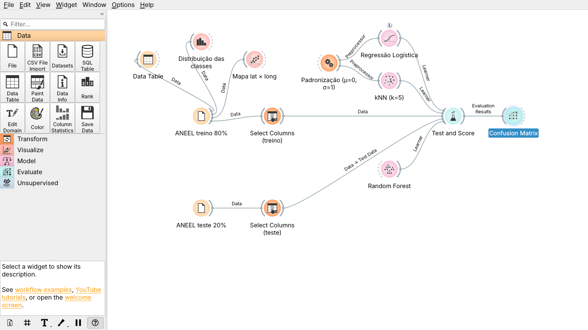

| Algoritmo (widget) | Configuração | CA | Precision | Recall | F1 | AUC |
|---|---|---:|---:|---:|---:|---:|
| Logistic Regression | Ridge (L2), C = 1, com **Preprocess → Standardize (μ=0, σ²=1)** | 0,825 | 0,831 | 0,825 | 0,823 | 0,904 |
| kNN | 5 vizinhos, Euclidiana, pesos uniformes, com a mesma padronização | 0,965 | 0,965 | 0,965 | 0,965 | 0,987 |
| **Random Forest** | 100 árvores, mínimo 5 amostras para dividir, semente fixa | **0,973** | **0,973** | **0,973** | **0,973** | **0,993** |

*Procedimento:* Test and Score → *Test on test data* (3.100 linhas de treino, 776 de teste). Precision, Recall e F1 aparecem com *(None, show average over classes)*, que no Orange é a **média ponderada** pelo número de exemplos de cada classe (no Python usamos média macro; como as classes estão quase equilibradas, os valores são muito próximos).

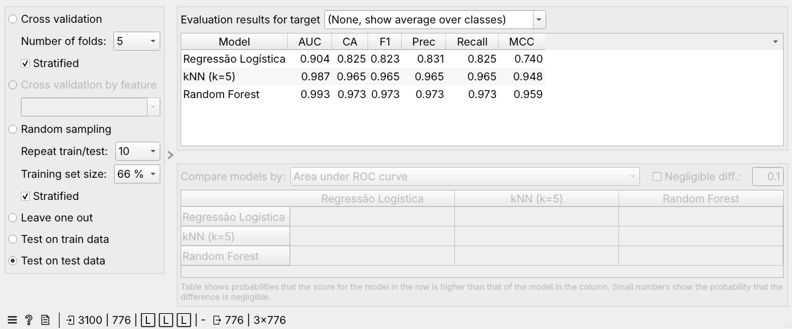

| Regressão Logística | kNN | Random Forest |
|---|---|---|
| 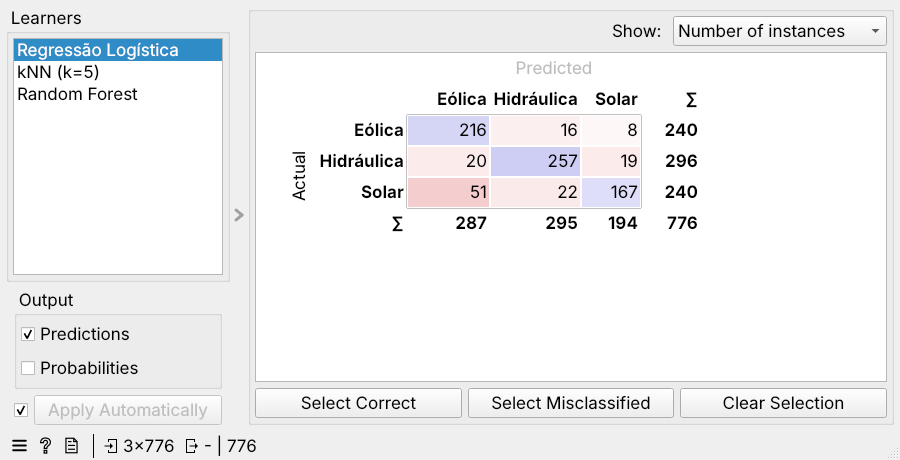 | 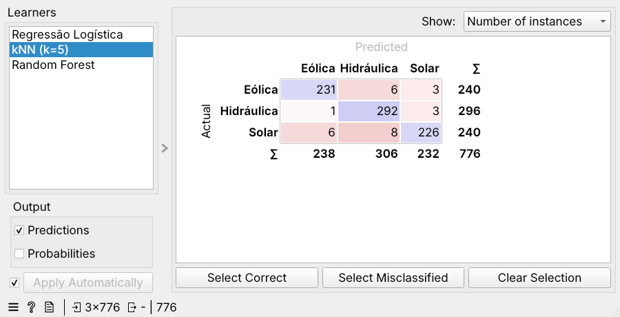 | 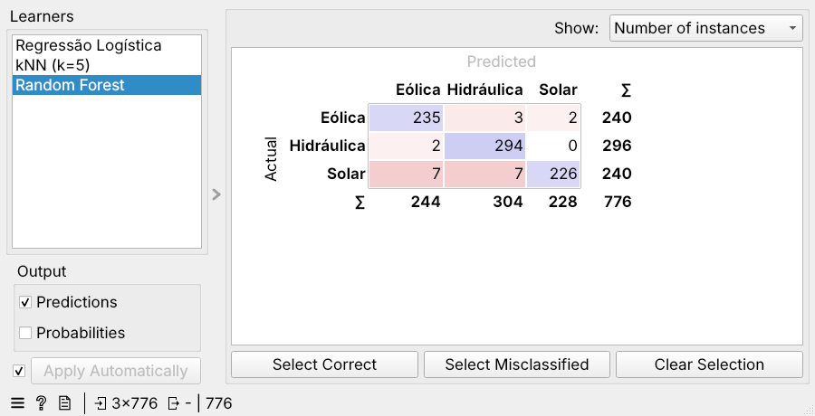 |

**Análise:** Random Forest teve o melhor desempenho (CA 0,973), seguida do kNN (0,965); a Regressão Logística ficou bem atrás (0,825). A classe mais confundida é **Solar**: a Regressão Logística classifica 51 solares como Eólica e 22 como Hidráulica; a Random Forest erra 14 solares (7 como Eólica, 7 como Hidráulica). Hidráulica é a classe mais fácil (294 de 296 acertos na Random Forest), porque ocupa uma região própria (Sul/Sudeste/Centro-Oeste) e uma faixa ampla de potência.

**Padronização importa:** sem o widget *Preprocess*, a Logistic Regression cai para CA ≈ 0,71 e o kNN para ≈ 0,87, porque a potência (até 11 milhões de kW) domina a distância e o ajuste. Com a padronização aplicada dentro do learner (ajustada só no treino), os resultados são **idênticos** aos do Python (0,825 e 0,965). A Random Forest difere levemente (0,973 × 0,970) porque a amostragem aleatória das árvores não é a mesma.

**Limitação:** potência e localização só funcionam bem aqui porque a amostra é agrupada (ex.: 732 solares de ~1 kW no mesmo ponto do Pará). Os resultados não valem para o cadastro inteiro, e a contagem de exemplos não representa a participação das fontes na matriz energética brasileira.

### Fluxo 2 — Regressão (Open-Meteo)

`File (treino: 80% iniciais) → Select Columns → Test and Score ← Select Columns ← File (teste: 20% finais)`. Em **Select Columns**: *Features* = `temperatura_c`, `umidade_pct`, `nuvens_pct`, `vento_kmh`, `hora`; *Target* = `radiacao_w_m2`; *Metas* = `data_hora`. Os modelos treinados também vão para **Predictions** (erro de cada hora do teste) e um **Scatter Plot** de real × previsto.

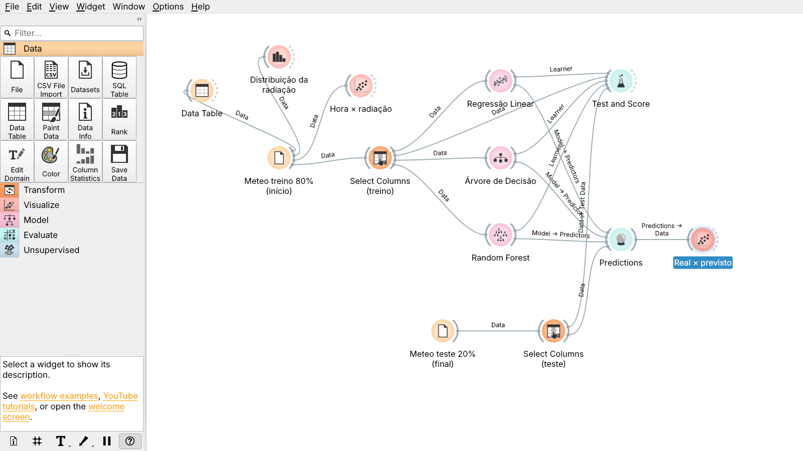

| Algoritmo (widget) | Configuração | MAE (W/m²) | MSE ((W/m²)²) | RMSE (W/m²) | R² |
|---|---|---:|---:|---:|---:|
| Linear Regression | Mínimos quadrados, sem regularização | 145,2 | 30.034 | 173,3 | 0,360 |
| Tree | Árvore binária, mín. 2 instâncias por folha, não divide subconjuntos < 5, profundidade máx. 100 | 86,1 | 13.829 | 117,6 | 0,705 |
| **Random Forest** | 100 árvores, mínimo 5 amostras para dividir, semente fixa | **67,6** | **7.450** | **86,3** | **0,841** |

*Procedimento:* divisão temporal feita **antes** do Orange (800 primeiras horas em `meteo_treino_80.csv`, 201 últimas em `meteo_teste_20.csv`) e Test and Score em *Test on test data*. O Orange mostra MSE diretamente; caso a versão mostre só RMSE, vale **MSE = RMSE²** (ex.: 86,3² ≈ 7.450).

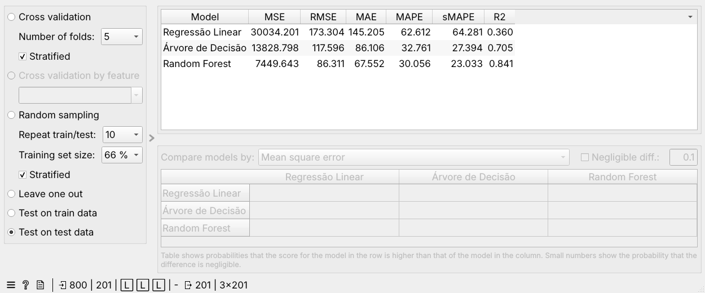

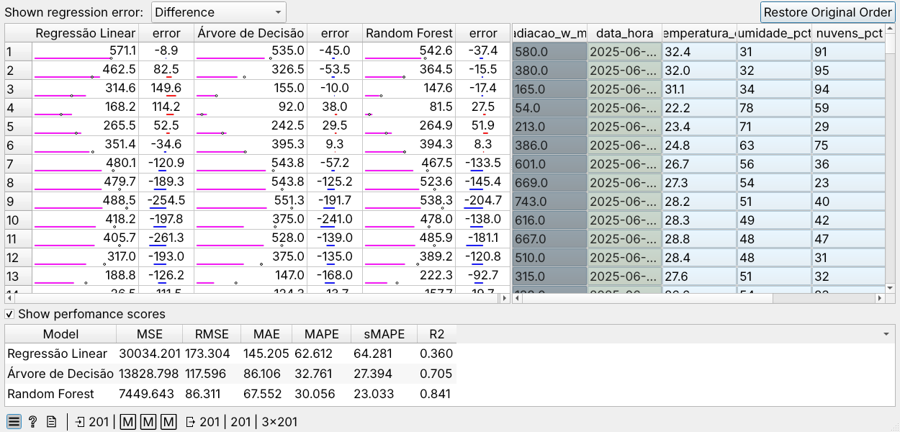

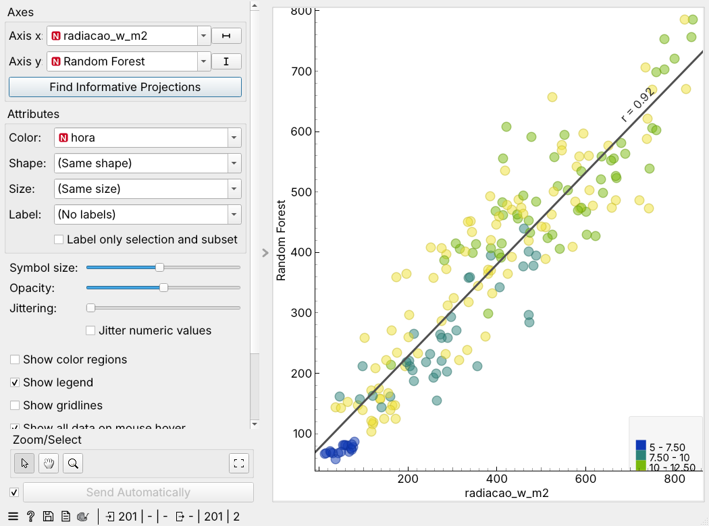

**Análise:** os três regressores seguem a mesma ordem do Python. A **Random Forest** é a melhor (MAE 67,6 W/m², R² 0,841); a **Tree** fica no meio (R² 0,705); a **Linear Regression** é a pior (R² 0,360) e produz exatamente os mesmos números do Python, como esperado para um modelo determinístico. No gráfico real × previsto (cor = hora), os pontos das 7h–8h (em azul) ficam no canto inferior, perto da reta; os maiores desvios aparecem nas horas centrais, quando as nuvens fazem a radiação variar. A **hora** é decisiva porque define a altura do Sol, mas sua relação com a radiação é em forma de sino, que só os modelos de árvore representam. E **radiação não é geração**: o valor em W/m² mede o recurso solar que chega ao solo; a energia elétrica depende do sistema fotovoltaico (área, eficiência, temperatura, inclinação, perdas).

### Python × Orange

| Tarefa | Algoritmo | Python | Orange |
|---|---|---|---|
| Classificação (Accuracy / CA) | Regressão Logística | 0,825 | 0,825 |
| | kNN | 0,965 | 0,965 |
| | Random Forest | 0,970 | 0,973 |
| Regressão (R²) | Regressão Linear | 0,360 | 0,360 |
| | Árvore de Decisão | 0,694 | 0,705 |
| | Random Forest | 0,841 | 0,841 |

As pequenas diferenças vêm das implementações: a árvore do Orange é a do próprio Orange (não a do scikit-learn), e a Random Forest usa outra sequência aleatória.

---

## Conclusões gerais

| Tarefa | Melhor modelo | Resultado no teste | Principal limitação |
|---|---|---|---|
| Classificação da fonte (ANEEL) | Random Forest | Accuracy 0,970 (Python) / 0,973 (Orange) | Amostra não aleatória; só três entradas |
| Regressão da radiação (Open-Meteo) | Random Forest | MAE ≈ 68 W/m², R² 0,84 | Relação não linear com a hora; sem variável de época do ano; radiação ≠ geração |

Nas duas tarefas os modelos lineares ficaram em último lugar, porque as relações são não lineares (regiões geográficas na classificação; curva diária do Sol na regressão). O ensemble de árvores (Random Forest) foi o mais preciso e o mais estável.

## Fontes

- [ANEEL — SIGA (dados abertos)](https://dadosabertos.aneel.gov.br/dataset/siga-sistema-de-informacoes-de-geracao-da-aneel)
- [ANEEL — recurso e campos usados](https://dadosabertos.aneel.gov.br/dataset/siga-sistema-de-informacoes-de-geracao-da-aneel/resource/11ec447d-698d-4ab8-977f-b424d5deee6a)
- [Open-Meteo — API histórica e unidades](https://open-meteo.com/en/docs/historical-weather-api)
- [scikit-learn](https://scikit-learn.org/) · [Orange Data Mining](https://orangedatamining.com/)
